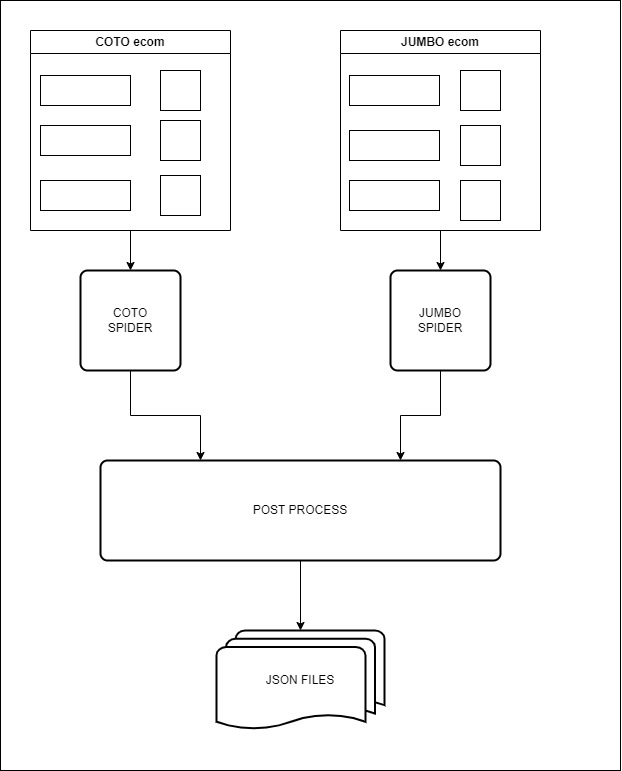

# marketScraper
### Given the current inflation in Argentina, I felt motivated to build a tool that allows quick and easy access to the prices of products in different supermarkets.

### This application scrapes the ecommerce of the Coto and Jumbo supermarkets, obtaining the name of the product, its price and which category it corresponds to. The date of obtaining is also added to have a historical record of prices.

### To build it, I used Python and the Scrapy library, which allows me to have an organized environment for future extensions of the application. The method of obtaining data is different for each supermarket. 
### For Coto I mainly used XPath to find the html elements of the pages. In the case of Jumbo, I managed to find the request links to obtain the data directly from the backend, the main challenge being finding the ids of the products and their tree structure with their respective categories and sub-categories. In turn, the application has a small post processing that transforms the data into a convenient format for carrying out market analysis.

### The application is started by running a bash file

### I learned how to use xpath and how the ecommerce backend works. I also gained experience in the scrapy framework.
